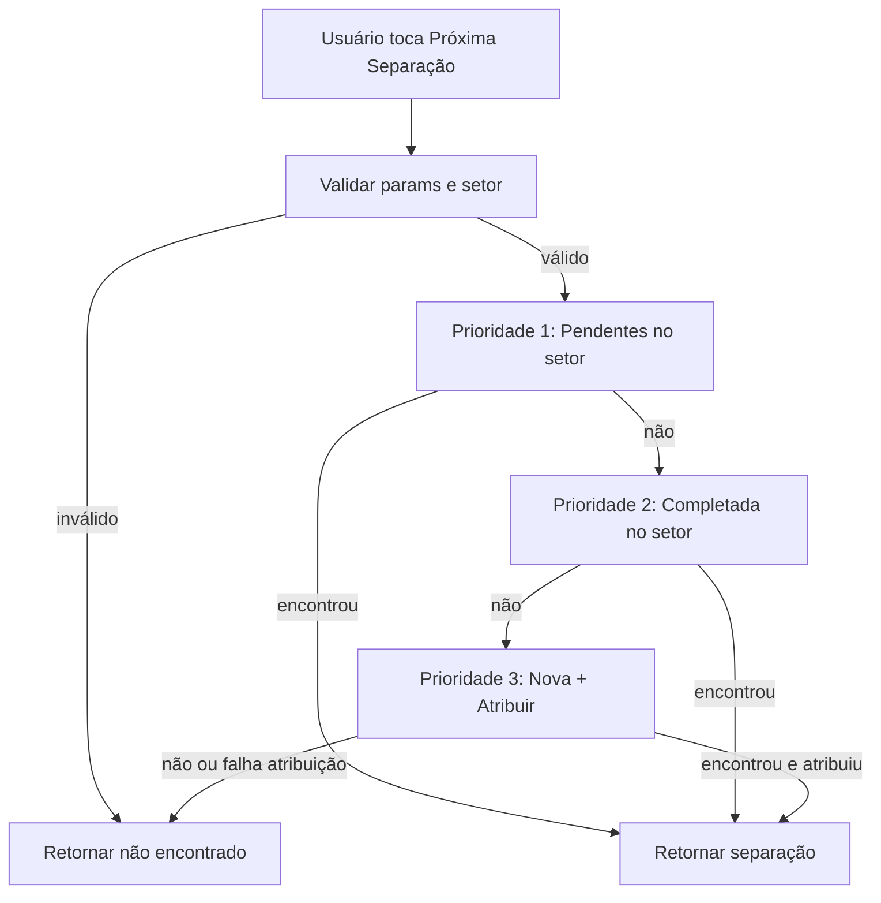

# Processo "Próxima Separação" – Regras de Negócio e Implementação

Este documento descreve as regras de negócio e a implementação do fluxo **Próxima Separação**, que determina qual separação o usuário deve abrir ao acionar o botão "Próxima Separação" na tela de listagem de separações.

---

## 1. Visão geral do processo

O processo **Próxima Separação** responde à pergunta: _qual separação o usuário deve abrir agora?_

- **Onde é acionado:** tela de listagem de separações (`SeparationScreen`), através do FAB (Floating Action Button) "Próxima Separação".
- **Resultado esperado:** retornar uma única separação (já atribuída ou recém-atribuída ao usuário no setor dele) ou informar que não há separação pendente.
- **Escopo:** sempre no **setor do usuário** e para o **usuário logado** (empresa + usuário + setor estoque obrigatórios).

O fluxo segue Clean Architecture: a tela chama o use case de domínio, que usa repositório de consulta e o use case de atribuição quando for nova separação.

---

## 2. Regras de negócio

### 2.1 Pré-requisitos (validação antes da busca)

| Regra             | Descrição                                                                             | Falha retornada                               |
| ----------------- | ------------------------------------------------------------------------------------- | --------------------------------------------- |
| Usuário válido    | `codUsuario` e `codEmpresa` devem ser maiores que zero; `userSystemModel` obrigatório | `NextSeparationUserFailure.invalidParams`     |
| Setor obrigatório | Usuário deve possuir setor estoque configurado (`codSetorEstoque != null` e `> 0`)    | `NextSeparationUserFailure.userWithoutSector` |

Sem setor, o usuário não pode participar do processo de “próxima separação” (regra de negócio: cada ator atua em um setor).

### 2.2 Prioridade 1 – Voltar na mesma separação (itens ou carrinhos pendentes)

**Regra:** Sempre que existir uma separação **já atribuída ao usuário**, no **setor do usuário**, com **itens a separar** ou **carrinhos para salvar**, essa separação deve ser a primeira opção.

- **Objetivo:** evitar que o usuário abandone uma separação em andamento; ele deve continuar na mesma até concluir (itens + carrinhos).
- **Critérios de busca:**
  - `CodEmpresa` = empresa do usuário
  - `CodUsuario` = usuário atual
  - `CodSetorEstoque` = setor estoque do usuário
  - Situação **não** pode ser: CANCELADA, SEPARADO, EM PAUSA, BLOQUEADA
  - **E** pelo menos uma das condições:
    - `QuantidadeItensSetor > QuantidadeItensSeparacaoSetor` (ainda há itens do setor a separar)
    - `CarrinhosAbertosUsuario = 'S'` (há carrinhos abertos do usuário)

Se houver resultado, ele é retornado e o fluxo encerra (não se busca completada nem nova).

### 2.3 Prioridade 2 – Separação 100% completada no setor (para finalizar)

**Regra:** Se não houver separação com pendências (Prioridade 1), buscar separação **já atribuída ao usuário** no **setor**, com **todos os itens do setor separados** e **todos os carrinhos salvos**, para o usuário poder finalizar.

- **Objetivo:** permitir que o usuário conclua/confirme a separação (ex.: mudar situação para SEPARADO) antes de receber uma nova.
- **Critérios de busca:**
  - `CodEmpresa`, `CodUsuario`, `CodSetorEstoque` = empresa, usuário e setor do usuário
  - `SepararEstoqueSituacao` = SEPARANDO
  - `QuantidadeItensSetor = QuantidadeItensSeparacaoSetor` (setor 100% separado)
  - `CarrinhosAbertosUsuario != 'S'` (sem carrinhos abertos)

Se houver resultado, ele é retornado (não se busca nova separação).

### 2.4 Prioridade 3 – Nova separação (atribuição)

**Regra:** Só quando não existir separação nas Prioridades 1 e 2, buscar uma **nova** separação **disponível** (ainda sem usuário atribuído) no setor do usuário e **atribuir** ao usuário antes de retornar.

- **Objetivo:** cada separação no setor tem um único responsável; a atribuição é a confirmação de que aquele usuário assumiu aquela separação naquele setor.
- **Critérios de busca:**
  - `CodEmpresa` = empresa do usuário
  - `CodSetorEstoque` = setor do usuário
  - `CodUsuario IS NULL` (separação ainda não atribuída)
  - Ainda há itens a separar no setor: `QuantidadeItensSetor > QuantidadeItensSeparacaoSetor`
  - Situação **não** pode ser: CANCELADA, SEPARADO, EM PAUSA, BLOQUEADA

Após encontrar uma separação disponível, o sistema **registra a atribuição** (use case `RegisterSeparationUserSectorUseCase`). Se o registro falhar, há retry (até 3 tentativas) buscando outra separação disponível.

### 2.5 Situações excluídas da “próxima separação”

As situações abaixo **não** entram como candidatas em Prioridade 1 e Prioridade 3 (e indiretamente em Prioridade 2, que exige situação SEPARANDO):

| Código    | Descrição | Motivo                             |
| --------- | --------- | ---------------------------------- |
| CANCELADA | Cancelada | Separação não está ativa           |
| SEPARADO  | Separado  | Já concluída no fluxo de separação |
| EM PAUSA  | Em Pausa  | Suspensa                           |
| BLOQUEADA | Bloqueada | Indisponível                       |

Ou seja: o processo considera apenas separações “em andamento” ou “aguardando”, nunca canceladas, finalizadas, em pausa ou bloqueadas.

### 2.6 Regras de atribuição e responsabilidade

- **Atribuição obrigatória:** o usuário só pode “iniciar” uma nova separação (Prioridade 3) após a atribuição ser registrada (confirmação de que a separação naquele setor foi assumida por ele).
- **Um usuário por setor por separação:** cada separação, em cada setor, tem um único usuário responsável. A unicidade é garantida pelo registro de atribuição (e deve ser garantida no backend ao persistir).
- **Não pegar próxima sem completar:** o usuário só recebe uma **nova** separação (Prioridade 3) quando não tiver nenhuma separação sua com itens pendentes ou carrinhos abertos (Prioridade 1) e nenhuma completada para finalizar (Prioridade 2). A ordem das prioridades garante essa regra.

### 2.7 Abertura apenas de separações vinculadas (botão "Abrir Separação")

- **Usuário com setor:** Se o usuário possui `codSetorEstoque` (não nulo e maior que zero), ele **só pode abrir** separações em que esteja participando (vinculado), ou seja, cujo `codUsuariosSeparacao` contenha o `codUsuario` dele. A verificação é feita antes da navegação na tela de listagem (`SeparationScreen._onSeparationTap`) e também ao entrar na tela de itens (`SeparationItemsScreen`).
- **Usuário sem setor:** Se o usuário não possui setor (null ou zero), mantém-se permissão administrativa: pode abrir qualquer separação da lista.
- **Verificação centralizada:** A checagem é feita através do use case **ResolveSeparationUserLinkUseCase**: quando `codUsuariosSeparacao` não está vazio, usa-se os dados da listagem (`contains(codUsuario)`); quando está vazio, o use case chama o **CheckSeparationUserSectorLinkUseCase** (consulta `separar.usuario.setor.consulta`) como fallback para decidir se permite abrir.

### 2.8 Incluir Carrinho apenas em separações vinculadas

- **Usuário com setor:** Se o usuário possui `codSetorEstoque` (não nulo e maior que zero), ele **só pode incluir carrinho** em separações em que esteja participando (vinculado), ou seja, cujo `codUsuariosSeparacao` contenha o `codUsuario` dele. A verificação é feita antes de navegar para a tela de incluir carrinho (`SeparationItemsScreen._onAddCart`).
- **Usuário sem setor:** Se o usuário não possui setor (null ou zero), mantém-se permissão administrativa: pode incluir carrinho em qualquer separação.
- **Verificação centralizada:** O **ResolveSeparationUserLinkUseCase** é usado também em Incluir Carrinho: quando `codUsuariosSeparacao` não está vazio usa os dados da listagem; quando está vazio usa o **CheckSeparationUserSectorLinkUseCase** (evento `separar.usuario.setor.consulta`) como fallback antes de permitir incluir carrinho.

### 2.9 Permissões para carrinho de outro usuário (Separar / Salvar / Cancelar)

Na tela de itens da separação, cada carrinho pode ter sido iniciado pelo próprio usuário ou por outro. As ações **Separar** (editar), **Salvar** (finalizar) e **Cancelar** (excluir) obedecem às permissões do usuário no sistema:

| Permissão (UserSystemModel) | Ação na UI | Regra |
| --------------------------- | ---------- | ----- |
| `editaCarrinhoOutroUsuario == Situation.ativo` | **Separar** (abrir carrinho para separar itens) | Permite separar carrinho de outro usuário; caso contrário, só o dono do carrinho pode separar. |
| `salvaCarrinhoOutroUsuario == Situation.ativo` | **Salvar** (finalizar carrinho) | Permite salvar carrinho de outro usuário; caso contrário, só o dono pode salvar. |
| `excluiCarrinhoOutroUsuario == Situation.ativo` | **Cancelar** (excluir/cancelar carrinho) | Permite cancelar carrinho de outro usuário; caso contrário, só o dono pode cancelar. |

- **Dono do carrinho:** se `codUsuario` atual for igual a `codUsuarioInicio` do carrinho, o usuário sempre pode Separar, Salvar e Cancelar aquele carrinho, independentemente das permissões acima.
- **Outro usuário:** só pode executar a ação se tiver a permissão correspondente (`Situation.ativo`); caso contrário, o app exibe diálogo "Acesso Negado" e não executa a ação.
- **Implementação:** `CartValidationService` centraliza a lógica (`canEditOtherUserCart`, `canSaveOtherUserCart`, `canDeleteOtherUserCart`) e é chamado antes de navegar para Separar, antes de Salvar e antes de abrir o diálogo de Cancelar em `cart_item_card.dart`, e antes de Salvar em `card_picking_viewmodel.dart`.

---

## 3. Fluxo da implementação

### 3.1 Camadas envolvidas

```
Presentation (SeparationScreen)
    → chama NextSeparationUserUseCase com NextSeparationUserParams
Domain (NextSeparationUserUseCase)
    → consulta BasicConsultationRepository<SeparationUserSectorConsultationModel>
    → se Prioridade 3: chama RegisterSeparationUserSectorUseCase
Infrastructure (repositórios concretos / socket)
    → SeparationUserSectorConsultationRepositoryImpl (consulta)
    → repositório de SeparationUserSectorModel (inserção da atribuição)
```

### 3.2 Sequência resumida (Próxima Separação)

1. Usuário toca no FAB "Próxima Separação" na tela de separações.
2. A tela obtém sessão (UserSessionService), monta `NextSeparationUserParams` (empresa, usuário, setor, userSystemModel) e valida setor.
3. Chama `NextSeparationUserUseCase(params)`.
4. Use case valida parâmetros (incluindo `hasValidSector`).
5. **Prioridade 1:** busca separação do usuário no setor com (itens a separar OU carrinhos abertos). Se encontrar, retorna.
6. **Prioridade 2:** busca separação do usuário no setor 100% completada (itens + carrinhos). Se encontrar, retorna.
7. **Prioridade 3:** busca separação disponível (CodUsuario IS NULL) no setor; se encontrar, chama `RegisterSeparationUserSectorUseCase` para atribuir; em falha, retry até 3 vezes.
8. Retorno: `NextSeparationUserSuccess.found(separation)` ou `NextSeparationUserSuccess.notFound()` ou `NextSeparationUserFailure` (validação, rede, etc.).
9. Se sucesso com separação, a tela verifica se `separation.codUsuario == params.codUsuario`, converte para `SeparateConsultationModel` e navega para a tela de itens da separação (`AppRouter.separateItems`).

### 3.3 Diagrama de prioridades (lógico)



---

## 4. Detalhamento da implementação

### 4.1 Arquivos principais

| Camada       | Arquivo                                                                                                | Responsabilidade                                                                                                                            |
| ------------ | ------------------------------------------------------------------------------------------------------ | ------------------------------------------------------------------------------------------------------------------------------------------- |
| Presentation | `lib/ui/screens/separation_screen.dart`                                                                | FAB "Próxima Separação", montagem de params a partir da sessão, chamada ao use case, tratamento de resultado e navegação para tela de itens |
| Domain       | `lib/domain/usecases/next_separation_user/next_separation_user_usecase.dart`                           | Orquestração das três prioridades, validação, consulta e atribuição                                                                         |
| Domain       | `lib/domain/usecases/next_separation_user/next_separation_user_params.dart`                            | Parâmetros de entrada (codEmpresa, codUsuario, codSetorEstoque, userSystemModel) e validação (isValid, hasValidSector)                      |
| Domain       | `lib/domain/usecases/next_separation_user/next_separation_user_success.dart`                           | Resultado de sucesso (separation opcional, message) e factory `found` / `notFound`                                                          |
| Domain       | `lib/domain/usecases/next_separation_user/next_separation_user_failure.dart`                           | Tipos de falha (userWithoutSector, invalidParams, networkError, unknownError) e mensagens ao usuário                                        |
| Domain       | `lib/domain/usecases/resolve_separation_user_link/resolve_separation_user_link_usecase.dart`         | Verificação centralizada de vínculo usuário–separação: usa listagem quando `codUsuariosSeparacao` não vazio, senão chama CheckSeparationUserSectorLinkUseCase |
| Domain       | `lib/domain/usecases/resolve_separation_user_link/resolve_separation_user_link_params.dart`           | Parâmetros do use case (separation, codUsuario, codSetorEstoque)                                                                           |
| Domain       | `lib/domain/usecases/check_separation_user_sector_link/check_separation_user_sector_link_usecase.dart` | Verificação de vínculo usuário–separação–setor (fallback usado por ResolveSeparationUserLinkUseCase quando `CodUsuariosSeparacao` vazio)   |
| Domain       | `lib/domain/usecases/register_separation_user_sector/register_separation_user_sector_usecase.dart`     | Registro da atribuição usuário–separação–setor (Prioridade 3)                                                                               |
| Domain       | `lib/domain/models/separation_user_sector_consultation_model.dart`                                     | Modelo de consulta (separação + setor + usuário + quantidades + carrinhos abertos)                                                          |
| Domain       | `lib/domain/models/situation/expedition_situation_model.dart`                                          | Situações da expedição (ex.: SEPARANDO, SEPARADO, CANCELADA) usadas nas buscas e exclusões                                                  |
| Data         | `lib/data/repositories/separation_user_sector_consultation_repository_impl.dart`                       | Implementação da consulta (ex.: evento socket `separar.usuario.setor.consulta`)                                                             |
| Domain       | `lib/domain/services/cart_validation_service.dart`                                                     | Validação de acesso ao carrinho: dono ou permissão (EditaCarrinhoOutroUsuario, SalvaCarrinhoOutroUsuario, ExcluiCarrinhoOutroUsuario). Recebe repositório por injeção de dependência (construtor); não utiliza locator. Usado antes de Separar, Salvar e Cancelar |
| Presentation | `lib/ui/widgets/separate_items/cart_item_card.dart`                                                     | Card do carrinho na tela de itens; obtém `CartValidationService` do locator e chama `validateCartAccess` / `hasItemsForUserSector` em _onSeparateCart, _onFinalizeCart, _showCancelDialog |
| Presentation | `lib/presentation/viewmodels/card_picking_viewmodel.dart`                                               | ViewModel da tela de separação por item; usa `CartValidationService` injetado (via locator) em `validateCartAccess` antes de salvar |

### 4.2 Parâmetros de entrada (NextSeparationUserParams)

- **codEmpresa** (int): código da empresa.
- **codUsuario** (int): código do usuário logado.
- **codSetorEstoque** (int?): código do setor estoque do usuário; obrigatório para o fluxo (`hasValidSector`).
- **userSystemModel** (UserSystemModel?): dados do usuário no sistema (ex.: nome para registro de atribuição).

Validação: `codEmpresa > 0`, `codUsuario > 0`, `userSystemModel != null`, `hasValidSector` (codSetorEstoque não nulo e > 0).

### 4.3 Query base e setor

Todas as buscas que consideram “separação do usuário” usam `_buildBaseQuery(params)`, que inclui:

- `CodEmpresa` = params.codEmpresa
- `CodUsuario` = params.codUsuario
- `CodSetorEstoque` = params.codSetorEstoque (quando `params.hasValidSector`)

Assim, Prioridade 1 e Prioridade 2 restringem sempre ao **usuário e ao setor** do usuário.

### 4.4 Retry na Prioridade 3

Se a atribuição (RegisterSeparationUserSectorUseCase) falhar após encontrar uma separação disponível, o use case tenta novamente até **3 vezes** (contagem total), com delay entre tentativas (ex.: 100ms × (retryCount + 1)). A cada tentativa, busca-se outra separação disponível (nova chamada a `_findNewSeparation`).

### 4.5 Verificação na tela antes de abrir

Antes de navegar para a tela de itens, a `SeparationScreen` verifica se `separation.codUsuario == params.codUsuario`. Se a separação retornada não estiver atribuída ao usuário atual, exibe modal de erro e não navega. Isso protege contra inconsistências (ex.: atribuição falhou no backend mas o app recebeu a separação).

---

## 5. Resumo das regras (checklist)

- Prioridade 1: sempre voltar na mesma separação (usuário + setor) se houver itens a separar ou carrinhos para salvar; situações CANCELADA, SEPARADO, EM PAUSA, BLOQUEADA excluídas.
- Prioridade 2: separação do usuário no setor 100% completada (itens + carrinhos) para finalizar; situação SEPARANDO.
- Prioridade 3: nova separação disponível (CodUsuario IS NULL) no setor, com atribuição obrigatória antes de retornar; retry em caso de falha na atribuição.
- Um usuário por setor por separação; usuário não recebe nova separação sem “completar” a atual (ordem das prioridades).
- Setor do usuário obrigatório; todas as buscas de separação do usuário filtradas por CodSetorEstoque.
- Abertura (botão "Abrir Separação"): usuário com setor só abre separações em que `codUsuariosSeparacao` contenha seu `codUsuario`; usuário sem setor tem permissão administrativa.
- Verificação de vínculo (abrir separação / entrada na tela de itens / incluir carrinho) centralizada no use case **ResolveSeparationUserLinkUseCase** (listagem quando `codUsuariosSeparacao` não vazio, fallback CheckSeparationUserSectorLinkUseCase quando vazio).
- Incluir Carrinho: usuário com setor só pode incluir carrinho em separações em que `codUsuariosSeparacao` contenha seu `codUsuario`; usuário sem setor tem permissão administrativa. Checagem em `SeparationItemsScreen._onAddCart` antes de navegar via ResolveSeparationUserLinkUseCase.
- Carrinho de outro usuário: Separar/Salvar/Cancelar permitidos apenas se o usuário for o dono do carrinho ou tiver a permissão correspondente no UserSystemModel (editaCarrinhoOutroUsuario, salvaCarrinhoOutroUsuario, excluiCarrinhoOutroUsuario); validação via CartValidationService antes de cada ação.

Este documento reflete o comportamento implementado no use case `NextSeparationUserUseCase` e nas telas `SeparationScreen` e `SeparationItemsScreen` conforme o código em `lib/`.

---

## 6. Verificação de consistência (regras do projeto e objetivos)

### 6.1 Objetivos

| Objetivo                                                                     | Implementação                                                                                                                                                                       | Status      |
| ---------------------------------------------------------------------------- | ----------------------------------------------------------------------------------------------------------------------------------------------------------------------------------- | ----------- |
| Prioridade 1: voltar na mesma separação (itens/carrinhos pendentes) no setor | `_findExistingSeparationWithPendingItems` chamada em primeiro lugar; `_buildBaseQuery` inclui `CodSetorEstoque` quando `hasValidSector`                                             | Consistente |
| Prioridade 2: separação 100% completada no setor para finalizar              | `_findCompletedSeparationByUser` em segundo; usa `_buildBaseQuery` com setor                                                                                                        | Consistente |
| Prioridade 3: nova separação + atribuição                                    | `_findNewSeparation` (CodUsuario IS NULL) + `RegisterSeparationUserSectorUseCase`; retry até 3x                                                                                     | Consistente |
| Usuário com setor só abre separações vinculadas                              | `SeparationScreen._onSeparationTap`: verifica via ResolveSeparationUserLinkUseCase antes de navegar; `SeparationItemsScreen`: mesma regra ao entrar e em Incluir Carrinho           | Consistente |
| Verificação de vínculo centralizada                                          | ResolveSeparationUserLinkUseCase usado em Abrir Separação, entrada na tela de itens e Incluir Carrinho; listagem quando `codUsuariosSeparacao` não vazio, CheckSeparationUserSectorLinkUseCase como fallback | Consistente |
| Usuário sem setor: permissão administrativa                                  | Em ambos os pontos: só aplica bloqueio quando `codSetorEstoque != null && codSetorEstoque > 0`                                                                                      | Consistente |
| Mensagem alinhada entre listagem e tela de itens                             | Mesmo texto: "Esta separação não está atribuída ao usuário atual. Por favor, utilize a opção 'Próxima Separação'."                                                                  | Consistente |
| Incluir Carrinho: usuário com setor só em separações vinculadas              | `SeparationItemsScreen._onAddCart`: antes do `context.push`, chama ResolveSeparationUserLinkUseCase; SnackBar e retorno sem navegar se não vinculado                                | Consistente |
| Fallback quando CodUsuariosSeparacao vazio                                   | ResolveSeparationUserLinkUseCase chama `CheckSeparationUserSectorLinkUseCase` quando a lista está vazia; consulta `separar.usuario.setor.consulta`                                | Consistente |
| Permissões carrinho outro usuário (Separar/Salvar/Cancelar)                  | `CartValidationService` (DIP: repositório injetado no construtor) usado em `cart_item_card.dart` e `card_picking_viewmodel.dart` via instância do locator; bloqueio e diálogo "Acesso Negado" quando sem permissão | Consistente |

### 6.2 Regras do projeto (Clean Architecture, convenções, dependências)

| Regra                                          | Onde verificar                                                                                                                                                                                                | Status                                          |
| ---------------------------------------------- | ------------------------------------------------------------------------------------------------------------------------------------------------------------------------------------------------------------- | ----------------------------------------------- |
| Domain não importa infrastructure/presentation | `NextSeparationUserUseCase`: apenas domain, core, results                                                                                                                                                     | Ok                                              |
| Use case retorna Result e usa interfaces       | `NextSeparationUserUseCase`: `Result<NextSeparationUserSuccess>`, `BasicConsultationRepository`, factory do RegisterUseCase                                                                                   | Ok                                              |
| DIP: injeção por construtor                    | Use case recebe repositório e factory no construtor; DI em `locator`                                                                                                                                          | Ok                                              |
| Presentation não importa infrastructure        | `SeparationScreen` importa `data/services/user_session_service`; regra diz "nunca importar de infrastructure". No projeto, `data/` é a camada de implementação; outras telas já usam esse padrão para sessão. | Padrão existente; não alterado por esta feature |
| Navegação com go_router                        | `context.push(AppRouter.separateItems)`, `context.pop()`                                                                                                                                                      | Ok                                              |
| Nomenclatura (camelCase, métodos privados \_)  | `_onSeparationTap`, `_showErrorModal`, `_findNextSeparation`                                                                                                                                                  | Ok                                              |
| Null safety                                    | Verificação `codSetorEstoque != null && codSetorEstoque > 0 && codUsuario != null` antes de usar; `mounted` antes de mostrar modal e navegar                                                                  | Ok                                              |
| Comentários apenas quando necessário           | Comentários em `_onSeparationTap` e `_onAddCart` explicam a regra (por quê); documentação em 2.7 e 2.8                                                                                                        | Ok                                              |

### 6.3 Documentação

- Regras de negócio (Prioridades 1–3, situações excluídas, atribuição, abertura vinculada, Incluir Carrinho, permissões carrinho outro usuário) descritas na seção 2 (2.1 a 2.9).
- Verificação de vínculo centralizada no **ResolveSeparationUserLinkUseCase** (seções 2.7 e 2.8); fallback quando `CodUsuariosSeparacao` vazio: **CheckSeparationUserSectorLinkUseCase** (consulta `separar.usuario.setor.consulta`).
- Permissões de carrinho de outro usuário (seção 2.9): regras EditaCarrinhoOutroUsuario, SalvaCarrinhoOutroUsuario, ExcluiCarrinhoOutroUsuario aplicadas via CartValidationService (repositório injetado) antes de Separar, Salvar e Cancelar; detalhes em `lib/domain/services/cart_validation_service.dart` e uso em `cart_item_card.dart` e `card_picking_viewmodel.dart`.
- Testes: use case `CheckSeparationUserSectorLink` com testes unitários; **testes de widget** para o fluxo "não vinculado" (ex.: `test/ui/screens/separation_screen_not_linked_test.dart`: toque em "Abrir Separação" com separação não atribuída → SnackBar com mensagem e sem navegação); mensagem única e SnackBar para "não vinculado" em todos os pontos (UX). Em `hasItemsForUserSector`, em caso de exceção o serviço registra o erro em log (AppLogger) antes de retornar `true` (fallback para não bloquear o usuário).
- Fluxo, arquivos e parâmetros descritos nas seções 3 e 4.

### 6.4 Observação (edge case)

- Se o usuário tiver setor mas `codUsuario` for null (sessão incompleta), `_onSeparationTap` não entra no bloco de verificação e permite navegar; a `SeparationItemsScreen` faz `currentUserId == null` e devolve o usuário. Ou seja, a segunda tela garante o bloqueio; opcionalmente pode-se tratar "tem setor e codUsuario == null" na listagem para evitar uma navegação desnecessária.
